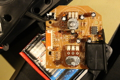

Logitech Z523 speaker schematic trace
=====================================

This is a rough trace of Logitech Z523 speakers' schematic. Assume it has
errors. Feel free to fix and tidy it up. If you do, it would be nice if you
could contribute the improvements back.

I'm publishing these traces in the hope that they will be useful to somebody
else troubleshooting a problem with this speaker model. I'm licensing the
tracing work under public domain. However, the rights for the design of the
speakers belong to Logitech.

My speakers developed a problem: the output would be skewed to one channel.
I wanted to fix them and traced the schematics for fun and practice. In the
end it turned out the volume pot had an issue (probably bumped during the
recent house move). I desoldered, disassembled, cleaned, adjusted, and put it
back. It worked without a problem afterwards.
